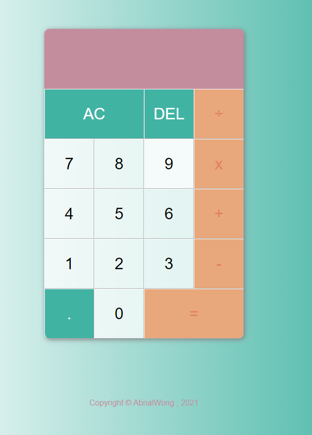
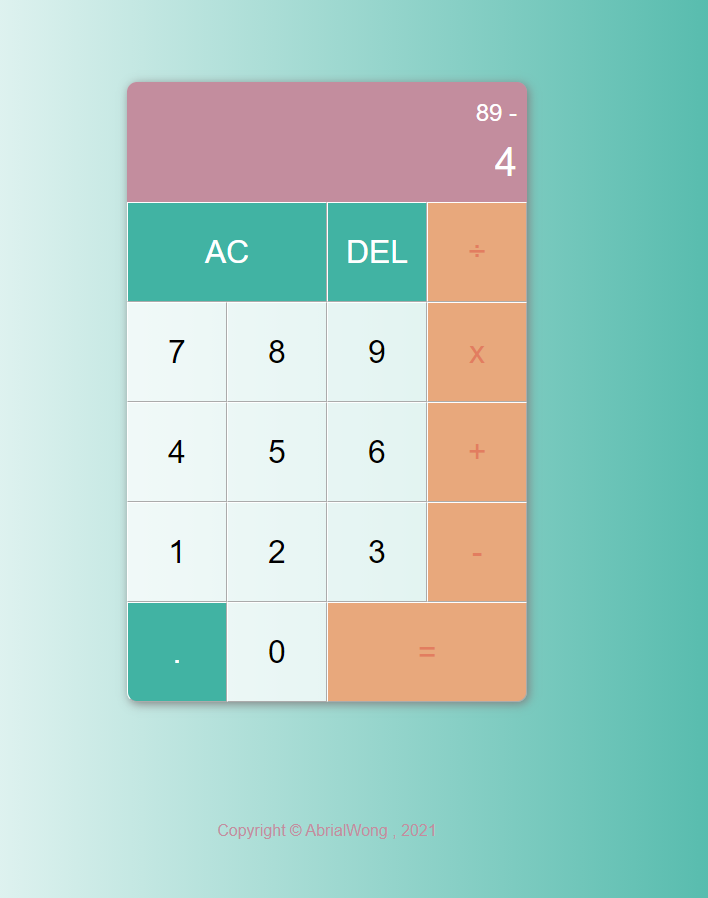

## Objectives
Created a simple calculator using react 

## Output 
Do a simple calculation with this cute calculator

## Getting Started

### Prerequisites

Things to install:
```
1) Node
2) Any Text Editor eg. Atom, Visual Studio Code
```
**- Currently I'm running on -** 
*Operating system* :  Windows 10 Pro
*Node* :  v14.16.10

## Running the tests

**Windows**
Step 1:  Open up a command prompt
```
open command prompt / hyper `
```
Step 2:  Change directory to your folderName
```
cd [folderName]
```
Step 3: Git clone or download the zip files of this project
```
git clone https://github.com/AbrialWong/calculator.git or download the zip files
```
Step 4: Run npm install / npm i to download the missing node_modules files
```
npm install or npm i
```
Step 5: Run npm start / yarn start
```
npm start or yarn start
```
## Expected output



## Authors
<a href="https://github.com/AbrialWong">Abrial Wong</a>

## Acknowledgments
Special thanks to:- 
1) Udemy
 React Projects - Build a Calculator by Shawn Foster

